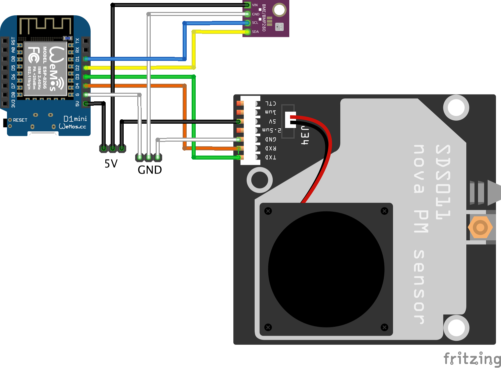

# Dust box prototype kit

_Fork BME280 GYBMEP version of the original dust_box for SMARTONvásár project_

Cloud support: https://iotguru.cloud

Support forum: https://forum.iotguru.live/viewtopic.php?f=17&t=6

- based on SDS-011 dust sensor and BME280 GYBMEP environmental sensor
- measure PM10, PM2.5, temperature, humidity and pressure and send it to our cloud

Live example: https://iotguru.live/device/u_m5VpzbejH2jIowKWYR6g

## Arduino IDE

First of all, in the preferences add the https://arduino.esp8266.com/stable/package_esp8266com_index.json to the list of Additional board managers.

Second, install the `The IoT Guru integration` library in the library manager.

## Wiring

| WEMOS | BME280 | SDS011 |
|-------|--------|--------|
| D1    | SCL    |        |
| D2    | SDA    |        |
| 5V    | VIN    | 5V     |
| GND   | GND    | GND    |
| D3    |        | TXD    |
| D4    |        | RXD    |

## Live data charts

https://smartonvasar.github.io/levego/

## Update flow

* update the `const char* ota_version = "smartonvasar-dust_box-box02-1.0.1";` value to the fresh version
* build it
* upload the fresh version to the firmwares section in the cloud
* set the target version in the device details

## sensor.community

Device registry: https://devices.sensor.community/sensors

